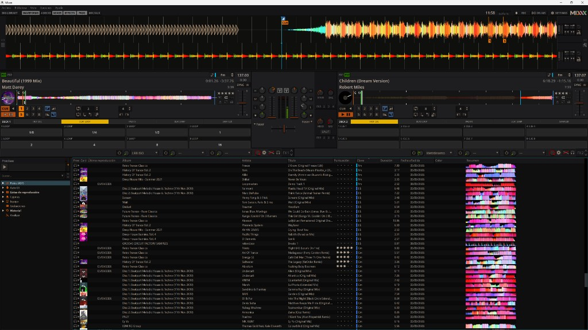

# MixxxF

Texto generado de forma autonoma por un agente de IA.

Fork personal de [Mixxx](https://github.com/mixxxdj/mixxx), enfocado a
**Pioneer DDJ-200** con la skin LateNight (Performance Pads).
No se envian pull requests a Mixxx oficial.

- GitHub: https://github.com/Fernan3D/MixxxF
- Rama de producto: `custom/mixxxf`
- Rama espejo de Mixxx: `main`

## Pioneer DDJ-200

El mapeo que hay que usar es **Pioneer DDJ-200 MixxxF**, no el perfil
original de Mixxx ni el XML/JS antiguo de AppData.

Los pads sin SHIFT siguen el modo de pantalla (HOT CUE, BEAT LOOP, PAD FX,
BEAT JUMP, SAMPLER). SHIFT+pads conserva el perfil personal (loop, slip,
reverse).

### Descargar el perfil

Estos dos archivos van juntos (el XML carga el JS):

| Archivo | Que es |
|---|---|
| [Pioneer DDJ-200 MixxxF.midi.xml](../res/controllers/Pioneer%20DDJ-200%20MixxxF.midi.xml) | Preset MIDI |
| [Pioneer-DDJ-200-MixxxF-scripts.js](../res/controllers/Pioneer-DDJ-200-MixxxF-scripts.js) | Logica de pads y LEDs |
| [DDJ-200-MixxxF-atajos.md](../res/controllers/DDJ-200-MixxxF-atajos.md) | Atajos |

Descarga directa (rama `custom/mixxxf`):

- https://github.com/Fernan3D/MixxxF/raw/custom/mixxxf/res/controllers/Pioneer%20DDJ-200%20MixxxF.midi.xml
- https://github.com/Fernan3D/MixxxF/raw/custom/mixxxf/res/controllers/Pioneer-DDJ-200-MixxxF-scripts.js

### Instalar solo el mapeo (Mixxx ya instalado)

1. Copia **los dos** archivos a `%LOCALAPPDATA%\Mixxx\controllers\`
   (en Windows suele ser `C:\Users\<tu-usuario>\AppData\Local\Mixxx\controllers\`).
2. No sustituyas `Pioneer DDJ-200.midi.xml` ni `Pioneer-DDJ-200-scripts.js`
   si quieres conservar el perfil original.
3. Abre Mixxx → Preferencias → Controladores → DDJ-200 → elige
   **Pioneer DDJ-200 MixxxF**.
4. En el firmware de la mesa deja los pads en **HOT CUE**; el modo lo elige
   Mixxx en la pestaña PADS.

Si compilas este fork, el perfil ya se instala en la carpeta `controllers`
del programa.

## Como esta organizado

| Rama | Que contiene |
|---|---|
| `main` | Mixxx tal cual, sin cambios MixxxF. Se actualiza desde `upstream`. |
| `custom/mixxxf` | LateNight Performance Pads, Pad FX, mapeo Pioneer DDJ-200 MixxxF. |

Remotes:

- `origin` → `https://github.com/Fernan3D/MixxxF.git`
- `upstream` → `https://github.com/mixxxdj/mixxx.git`

Los archivos MixxxF nuevos (pads, `Pioneer DDJ-200 MixxxF.*`) casi no chocan
con Mixxx. Los que si pueden chocar al mezclar: `skin.xml`, `style.qss`,
`loopingcontrol.cpp`, `CMakeLists.txt`.

## Incorporar arreglos de Mixxx

1. Guarda o confirma tus cambios locales (`git status` limpio).
2. Ejecuta `actualizar-desde-mixxx.bat`.
3. Si Git para por conflictos, resuelvelos y `git merge --continue`.
4. Compila con `compilar-MixxxF.bat`.
5. Prueba en la mesa (pads + DDJ-200).
6. Cuando quieras publicarlo: `git push origin custom/mixxxf`.

El script **no sube nada a GitHub** y **no abre PR** contra Mixxx.

En GitHub, `main` se puede sincronizar solo (accion MixxxF — sincronizar main).
Eso no mezcla MixxxF: solo mantiene el espejo. El merge a `custom/mixxxf` lo
haces tu con el `.bat`.

## Compilar

`compilar-MixxxF.bat` deja el programa en `D:\MIXXXF\MixxxF`.

Texto generado de forma autonoma por un agente de IA.
